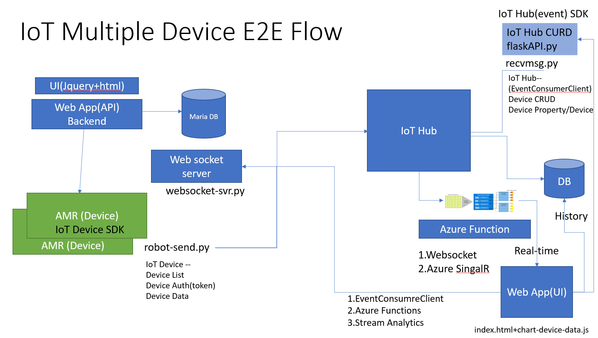
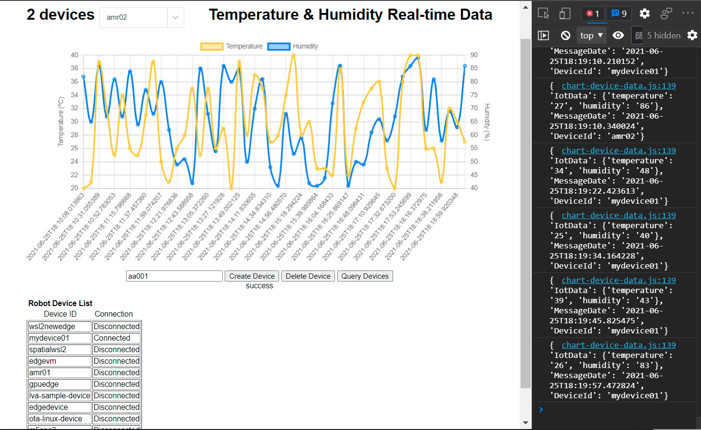

# AMRIoTE2E
## IoT Device End-to-End System architecture in Python implementation
> How to migrate single device to multiple device controllable framework

### Software Components 
- IoT Device SDK
- IoT Hub SDK
- EventHub SDK
- Websocket Server (SignalR)
- Simple Frond-End (Jquery+HTML5)
> 

#### PS. flaskAPI.py, recvmsg.py , robot-send.py can be merged into one single python file.

### Next Steps
>1. Cloud Implementation with Azure Functions,CosmosDB, Stream Analytics and SignalR
>2. Azure AD (B2C) Integration to control the permission
